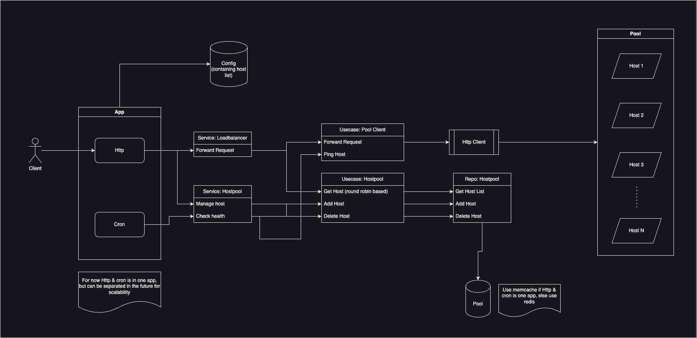

# Load Balancer App

This is a load balancer app that forwards requests to actual backend app services. It uses a round-robin algorithm for load balancing, ensuring balanced distribution of requests among the instances.

## Technologies Used
- Go programming language
- PostgreSQL

## Installation
### Prerequisites
- Go programming language
- Docker

### 1. Install Docker
Install Docker by downloading and installing the Docker Desktop app from the official website [here](https://www.docker.com/products/docker-desktop/).

### 2. Run Docker Containers
Use the provided `docker-compose.yml` file to install the backend app on Docker. Open a terminal and run the command `docker-compose up --build` to compose the Docker containers.

### 3. Run the Load Balancer Server
To run the load balancer server, execute the command `go run app/loadbalancer/app.go`.

## Testing the App
You can send HTTP requests to `localhost:8080` using any tool capable of making HTTP requests (e.g., curl). The requests should include a JSON payload in the request body. The load balancer will forward the request to one of the backend app servers, and you will receive the same JSON payload as the response. Check the headers of the response to see from which IP the request was processed.

The load balancer app performs regular health checks on the backend app servers. If a server becomes unavailable (e.g., stopped), the load balancer will detect it and exclude it from the pool of available servers. You can simulate this by stopping one of the backend app servers and observing the load balancer logs. Requests will not be forwarded to the stopped server.

You can also force a backend server to respond slowly by sending: (change X with the appropriate port you want to slow down)

```
curl --location 'http://127.0.0.1:909X/bounce/delay/add' \
--header 'Content-Type: application/json' \
--data '{
    "delay_second": 10
}'
```

when the app detects that the particular server is responding slowly, it will temporarily remove the server from pool.

Feel free to explore the load balancer app and test its functionality.

## Flow

